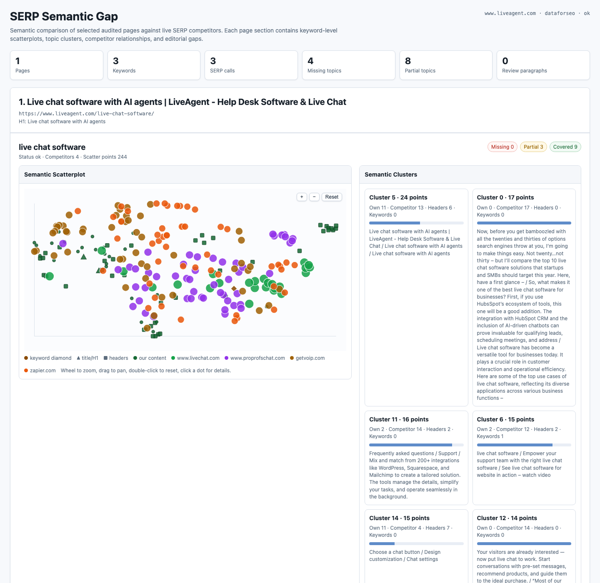

# SERP Gap Command

`site-audit serp-gap` is a separate SERP research workflow for one already-audited domain. It compares selected URLs from your site against the current Google results for chosen or discovered keywords.

It is intentionally not part of `site-audit run` because it can spend SERP API credits, fetch external competitor pages, embed many paragraphs, and take materially longer than a normal domain audit.

## Basic Usage

Run a normal audit first:

```bash
site-audit run www.example.com --search-provider all
```

Then run SERP gap analysis for a page or URL pattern:

```bash
site-audit
```

Choose `SERP gap analysis` from the main menu. For a single-page report, paste
the full target URL; the CLI derives the audited project domain from the URL
host and prefers an existing `projects/<domain>/report/pages.json` match. To
jump directly into the SERP gap wizard, run:

```bash
site-audit serp-gap --menu
```

The guided CLI menus explain each option, ask for the target URL or URL
pattern, keyword mode, SERP provider, country/language, and optional advanced
toggles, then print the equivalent command before executing it. In an
interactive terminal, choices support arrow keys, `j`/`k`, number shortcuts,
Enter to select, and `q`/Esc to cancel.

Direct command example:

```bash
site-audit serp-gap www.example.com \
  --url https://www.example.com/live-chat-software/ \
  --keyword-source file \
  --keyword "live chat software" \
  --keyword "livechat software" \
  --keyword "livechat" \
  --keywords-per-page 3 \
  --results-per-keyword 5 \
  --provider dataforseo \
  --country 2840 \
  --language en
```

Output is written to:

```text
projects/<domain>/serp_gap/report/
  <url-path-slug>/
    index.html
    serp_gap.json
    serp_gap.csv
    serp_gap_actions.csv
    serp_gap_todo.md
```

Each single-URL execution writes to a stable URL-specific directory, so rerunning
the same URL updates the same report while different URLs stay separate. For
homepage runs the directory is `home`; for multi-URL selections it starts with
`multi-url-`.

Cache is kept with the rest of the domain cache:

```text
projects/<domain>/cache/
  serp_gap/
  ahrefs/
```

The command should not create a separate cache tree outside the audited domain
project. For example, a LiveAgent run uses:

```text
projects/www.liveagent.com/cache/
```

## URL Selection

Analyze exact URLs:

```bash
site-audit serp-gap example.com --url https://www.example.com/features/chat/
```

Or select audited URLs by path pattern:

```bash
site-audit serp-gap example.com \
  --url-include "/features/*" \
  --url-exclude "/features/legacy/*"
```

`--url` can analyze a URL even if it was not present in `pages.json`, but the domain must still have an existing base audit.

## Keyword Selection

Use explicit suggested keywords:

```bash
site-audit serp-gap example.com \
  --url https://www.example.com/help-desk-software/ \
  --keyword-source file \
  --keyword "helpdesk software" \
  --keyword "help desk ticketing system"
```

Use a TSV file:

```text
url<TAB>keyword
https://www.example.com/help-desk-software/<TAB>helpdesk software
https://www.example.com/live-chat-software/<TAB>live chat software
```

Then run:

```bash
site-audit serp-gap example.com --keywords-file serp-gap-keywords.tsv
```

When search-provider data exists in the base audit, automatic keyword selection can use:

```text
auto
gsc
ahrefs
dataforseo
google_ads
h1
file
```

Use `--keyword-source file` when you pass `--keyword` or
`--keywords-file` and want those explicit keywords to drive the run.

### AI-Agent Keyword Selection And TODO Briefs

By default, `serp-gap` enables a Harnext AI-agent layer backed by OpenRouter.
Existing keyword sources still run first. If a selected URL has no usable
keyword rows, the agent inspects the page title, H1, headings, paragraphs, and
any existing search rows to infer target keywords before SERP analysis begins.
When `--language` is omitted, the same agent first detects the dominant page
language and uses that language code for SERP fetching. If the agent is not
available, `serp-gap` falls back to the audited/extracted page `html lang`
value when present.

Configure OpenRouter in `.env` or through `site-audit settings`:

```bash
OPENROUTER_API_KEY="sk-or-v1-..."
OPENROUTER_MODEL="deepseek/deepseek-v4-pro"
```

Harnext also needs its CLI on `PATH`:

```bash
npm install -g harnext
harnext --version
```

The `.env` file is ignored by git. In an interactive terminal, `serp-gap` can
also prompt for `OPENROUTER_API_KEY` on first execution and write it to `.env`.

URL-only example:

```bash
site-audit serp-gap www.liveagent.com \
  --url https://www.liveagent.com/blog/ai-support-paradox/ \
  --provider dataforseo \
  --country 2840
```

Pass `--language en` only when you want to override automatic language
detection for the SERP request.

After analysis, the agent generates a page-specific markdown brief with:

- exact keep, rewrite, move, merge, or remove decisions for weak paragraphs
- missing sections to add when competitors consistently cover them
- recommended content order based on semantic path evidence
- original draft copy for new or rewritten sections
- a `Final Article Draft` section that assembles the recommended article in
  final reading order
- acceptance criteria for an editor or AI coding/content agent

Prompts and completions are cached under:

```text
projects/<domain>/cache/serp_gap/ai_agent/
```

Use `--ai-agent-provider openrouter` to bypass the Harnext coding-agent CLI and
call OpenRouter chat completions directly. Use `--no-ai-agent` to disable AI
calls, and `--ai-agent-refresh` to regenerate cached prompts/completions. If
`OPENROUTER_API_KEY`, the Harnext Python SDK, or the Harnext CLI is absent, the
report states exactly what is missing and uses title/H1 fallback keywords
instead of fabricating demand metrics.

To expand explicit keywords with SERP-discovered related questions and
searches, enable:

```bash
site-audit serp-gap example.com \
  --url https://www.example.com/live-chat-software/ \
  --keyword-source file \
  --keyword "live chat software" \
  --include-serp-keyword-suggestions \
  --max-serp-keyword-suggestions 4
```

This adds People Also Ask and People Also Search suggestions from the SERP
payload. Those suggestions are useful for content coverage, but they often do
not have demand metrics unless GSC or Ahrefs has an exact matching keyword row.

## Providers

Supported SERP providers:

```text
dataforseo
serper
auto
```

`auto` uses Serper when `SERPER_API_KEY` or `SERPER_DEV_API_KEY` is set; otherwise it falls back to DataForSEO when credentials are available.

For DataForSEO, `--country` may be a numeric location code such as `2840` for United States. Use `--language en` for English SERPs.

## Ahrefs Metrics

Use Ahrefs when you want keyword traffic and volume context in the SERP gap
report:

```bash
site-audit serp-gap www.example.com \
  --url https://www.example.com/live-chat-software/ \
  --keyword-source file \
  --keyword "live chat software" \
  --provider dataforseo \
  --country 2840 \
  --language en \
  --use-ahrefs-metrics
```

Ahrefs enrichment is cache-first. It reuses compatible snapshots from:

```text
projects/<domain>/cache/ahrefs/
```

Useful Ahrefs flags:

```text
--use-ahrefs-metrics       attach Ahrefs position, traffic, and volume when keywords match
--ahrefs-refresh           ignore cached Ahrefs snapshots and fetch fresh data
--ahrefs-date YYYY-MM-DD   request a specific Ahrefs report date
--ahrefs-country us        optional Ahrefs country code, lowercase is safest
--ahrefs-mode subdomains   target mode: exact, prefix, domain, or subdomains
--ahrefs-top-pages-limit   top-pages rows to request
--ahrefs-keywords-limit    organic-keywords rows to request
```

Important: Ahrefs metrics are matched by keyword and URL when possible, then
by exact keyword as a fallback. The report does not invent traffic, clicks, or
impressions for manual keywords or SERP suggestions that do not appear in the
available API data. In that case the keyword metrics table shows
`No API metric match`, while the SERP columns still show observed ranking
positions from the live SERP fetch.

## Budget Controls

Use dry-run mode before expensive runs:

```bash
site-audit serp-gap example.com \
  --url-include "/features/*" \
  --dry-run
```

Useful caps:

```text
--max-pages
--keywords-per-page
--results-per-keyword
--max-competitor-pages
--max-paragraphs-per-page
--budget-usd
```

If `--budget-usd` is provided and the estimated uncached SERP cost exceeds it, the command writes a budget-exceeded report and stops before paid work.

## Report Interpretation

The top of the report is an action-first task board. Start there before
opening the diagnostic charts. It includes:

- page content briefs with priority score, target keywords, next tasks, and an AI-agent prompt
- prioritized content action cards for missing topics, partial topics, and low-alignment paragraphs
- paragraph rules and acceptance criteria for writing concise, useful sections
- expandable SERP URL, keyword metric, semantic scatterplot, frequency, impact, and cluster evidence

`serp_gap_actions.csv` contains the same tasks in a spreadsheet-friendly
format: target URL, keyword, topic, priority, instruction, placement,
paragraph plan, acceptance criteria, prompt, and SERP evidence.

Each analyzed page has its own section. Inside each page, every keyword has:

- keyword-specific content actions
- topic relation table
- paragraphs from your page to review
- expandable SERP competitor list, semantic scatterplot, and semantic cluster summary

Topic coverage labels:

```text
covered  - your page has a close paragraph-level match
partial  - your page is related but weaker or less direct
missing  - competitors cover the topic and your page has no close match
```

Treat the output as editorial evidence from the current SERP, not as proof of ranking causality.

## AI Agent Paragraph Instructions

When using the report to edit a page with an AI agent or human writer, use the
task cards as the source of truth:

- add or strengthen the highest-priority missing and partial topics first
- place each topic under a matching H2/H3 instead of appending unrelated text
- start important sections with a 1-2 sentence direct answer
- write 2-4 short paragraphs, each with one concrete point
- include practical details such as conditions, examples, steps, comparisons,
  limitations, pricing constraints, integrations, proof, or decision criteria
- move, merge, rewrite, or remove paragraphs that serve a different intent
- avoid broad introductions, generic adjectives, keyword stuffing, and copied
  competitor phrasing

The goal is not more text. The goal is denser information that directly
answers the search intent, demonstrates original experience or expertise, and
gives readers enough detail to make a decision.

## Content Action Plan For AI Agents

The report produces structured content actions in `serp_gap.json` for agents
or editors that need direct instructions for improving the selected landing
page. Read:

```text
action_points
pages[].action_points
pages[].analyses[].action_points
```

Actions are sorted by estimated priority and impact. Each action includes:

```text
type              add_topic, strengthen_topic, or review_paragraph
priority          critical, high, medium, or low
target_url        landing page to edit
keyword           keyword or SERP-discovered question/search
instruction       concrete editorial instruction
rationale         why this change matters
suggested_terms   terms to include naturally
impact_score      directional score from traffic/impressions/rank evidence
evidence          competitor examples, coverage, similarity, and ranking URLs
```

`add_topic` means competitors repeatedly cover a topic that is missing from
the landing page. `strengthen_topic` means the page has related content, but
the closest paragraph is semantically weaker than the ranking pages.
`review_paragraph` means an existing paragraph is far from the keyword topic
space and should be rewritten, expanded with relevant terms, moved, or removed.

Agents should treat `instruction` as the primary task, use `suggested_terms`
as vocabulary guidance, and use `evidence` to ground the rewrite in the
current SERP. They should not copy competitor text verbatim.

## Keyword And URL Tables

The aggregate `Keyword Metrics From APIs` table shows one row per selected
keyword. Columns include:

```text
Keyword
Keyword source
API metrics source
Analyzed URL
Matched metrics URL
Source position
Impressions
Clicks
Traffic
Volume
SERP URLs
Best SERP
Best ranking URL
```

`Keyword source` tells you why the keyword was selected, for example `manual`,
`gsc`, `ahrefs`, `h1`, `serp_people_also_ask`, or
`serp_people_also_search`.

`API metrics source` tells you where demand metrics came from. If it says
`No API metric match`, the keyword still has SERP evidence but no matching
GSC/Ahrefs/DataForSEO/Google Ads demand row in the available cache/API
payload.

The `Top-10 URLs Across Selected Keywords` section shows each ranking URL with
a nested keyword table instead of tags. That table includes:

```text
Rank
Keyword
Impressions
Clicks
Traffic
Volume
Source position
Source
```

`Rank` is the URL position in the fetched SERP for that keyword. `Source
position` is the selected domain's source/API position for the keyword when
available, such as an Ahrefs or GSC average/best position.

## Aggregate Semantic Map

The aggregate `All Keywords, URLs, and Content` scatterplot places every
selected keyword, processed URL, title, H1-H6 heading, and paragraph into one
shared vector space.

It also adds a demand-weighted keyword centroid:

- the centroid is a synthetic keyword point
- it is weighted by impressions first, then Ahrefs volume, then traffic/clicks
- its tooltip shows summed demand metrics and keyword count
- content near the centroid is semantically aligned with the combined keyword
  demand center

Use the domain and entity checkboxes to hide or show domains and node types.

## Keyword Frequency Analysis

The aggregate keyword frequency panel counts repeated terms and short phrases
from processed content. It is split into:

```text
Title Keywords
H1 Keywords
H2-H6 Keywords
Paragraph Keywords
```

The weighted word cloud uses these weights:

```text
Title:     8
H1:        7
H2:        5
H3:        4
H4-H6:     3
Paragraph: 1
```

Bigger words are repeated more often after applying those weights. Use this
to see whether high-impact page elements emphasize the same terms as the
paragraph body and the SERP competitors.

## Topic Traffic Impact

The topic impact chart estimates which aggregate semantic clusters carry the
most keyword demand. Clusters are sorted by:

```text
traffic, then impressions, then volume, then clicks
```

Treat this as directional. It helps decide which topic clusters deserve
editorial attention first, but it is not a causal ranking model.

## Scatterplot Encoding

The scatterplot uses semantic vectors for keywords, page titles, H1s, headers, and paragraphs.

Color:

- each competitor domain gets a stable distinct color
- your page content is green
- keyword anchors use a dedicated keyword color

Shape:

- keyword: diamond
- title and H1: triangle
- headers: square
- paragraphs: circle

Size:

- keyword points use impressions when available, then Ahrefs volume
- the keyword centroid uses summed impressions or volume
- competitor points use SERP rank, with higher-ranking results drawn larger
- other content points use readable defaults

Interactions:

- wheel to zoom
- drag to pan
- double-click to reset
- use `+`, `-`, and `Reset` chart buttons
- click a dot to open a persistent detail dialog
- press Escape to close open dialogs

The click dialog shows source/type badges, cluster, source, domain, SERP rank, URL, and a text excerpt.

## Common Recipes

Analyze one commercial page with suggested keywords:

```bash
site-audit serp-gap www.liveagent.com \
  --url https://www.liveagent.com/live-chat-software/ \
  --keyword-source file \
  --keyword "live chat software" \
  --keyword "livechat software" \
  --keyword "livechat" \
  --keywords-per-page 3 \
  --results-per-keyword 5 \
  --provider dataforseo \
  --country 2840 \
  --language en \
  --max-pages 1 \
  --max-competitor-pages 15 \
  --max-paragraphs-per-page 50 \
  --include-serp-keyword-suggestions \
  --max-serp-keyword-suggestions 4 \
  --use-ahrefs-metrics
```

Example output:



This example analyzes `https://www.liveagent.com/live-chat-software/`
against three keyword variants:

```text
live chat software
livechat software
livechat
```

The screenshot shows the report layout with semantic scatterplots,
domain-colored competitor points, keyword diamonds, title/H1 triangles,
header squares, paragraph circles, semantic cluster cards, and topic coverage
summary. Current reports also include the aggregate keyword/API metrics table,
per-URL keyword tables, weighted keyword frequency clouds, a demand-weighted
keyword centroid, and topic traffic impact chart.

Analyze a feature directory with conservative caps:

```bash
site-audit serp-gap example.com \
  --url-include "/features/*" \
  --keywords-per-page 2 \
  --results-per-keyword 5 \
  --max-pages 10 \
  --budget-usd 5
```

Refresh current SERPs but reuse competitor cache:

```bash
site-audit serp-gap example.com \
  --url-include "/solutions/*" \
  --refresh-serp
```

Refresh competitor pages too:

```bash
site-audit serp-gap example.com \
  --url-include "/solutions/*" \
  --refresh-serp \
  --refresh-competitors
```

## Structural / GEO Gaps

Each keyword card includes a Structural / GEO Gaps panel comparing page-structure signals against ranking competitors: FAQ/QA and Article/HowTo schema, question-form headings, statistics with units, external citations, comparison tables, and page depth. Signals seen on two or more competitors also become `structural` action points with concrete advice.

## People Also Ask Coverage

SERP features (People Also Ask questions, related searches, answer boxes) are captured from the SERP provider and each PAA question is scored against the page's paragraphs using the same embedding thresholds as topic coverage (covered >= 0.78, partial >= 0.62). Missing questions appear in the keyword card, in the TODO markdown, and as `answer_paa` action points.

## AI Agent Workspace Mode (Harnext)

With `--ai-agent-provider harnext` (default) and the Harnext CLI installed, the agent runs as a multi-turn coding agent over an on-disk evidence workspace written to `serp_gap/report/<run>/agent/<url-slug>/`:

- `evidence.json` — the full computed evidence for the URL (topics, heatmap with per-competitor cells, benchmark, structural patterns, PAA coverage, content order, action points)
- `our_page.md` — the page's complete content with paragraphs numbered `[P0]`, `[P1]`, ...
- `competitors/NN-domain.md` — outline and paragraphs of each ranking competitor
- `serp.json` — SERP rankings and features per keyword
- `TASK.md` — the agent instructions including the `recommendation.json` contract

The agent must write `recommendation.json` (validated: every paragraph gets exactly one keep/rewrite/move/merge/remove decision, new sections need drafts and valid placements) and `brief.md`. Invalid output triggers one automatic repair turn. Control the session length with `--ai-agent-max-turns` (default 20). With `--ai-agent-provider openrouter` the same JSON contract is requested inline in a single completion.

## Coverage Verification

After a valid recommendation, the recommended page (kept paragraphs + rewrites + new section drafts) is re-embedded locally and re-scored against the SERP topic centroids and PAA questions. The report shows before/after coverage (for example "missing 6 -> 0"); if critical or high-priority topics remain uncovered, one verification repair turn asks the agent to strengthen the recommendation.

## New Action Types

Besides `add_topic`, `strengthen_topic`, and `review_paragraph`, the action plan can include: `rewrite_title` (keyword missing from the title while most top competitor titles contain it, short titles, or empty H1), `expand_depth` (page is far below the top-5 competitor median depth), `structural` (structural/GEO pattern gaps), and `answer_paa` (missing People Also Ask answers). Near-duplicate topic actions across keywords of the same page are merged, keeping the highest-impact task (`merged_duplicates` records how many were folded in).

## Recommended Section Order

Each keyword card shows the section themes of ranking pages ordered by where competitors place them, marking themes the page already covers (`have`) and themes to add (`add`). Use it together with the AI recommendation outline to restructure the page.
